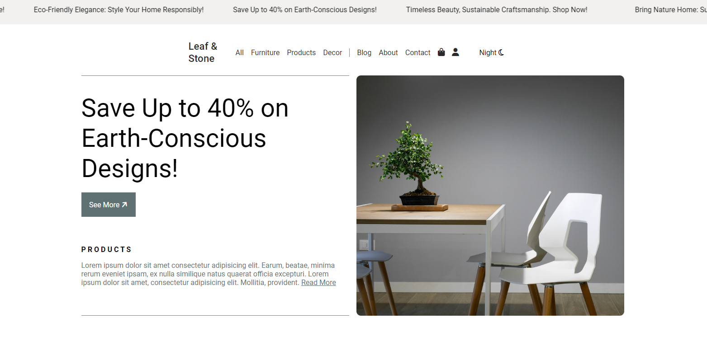
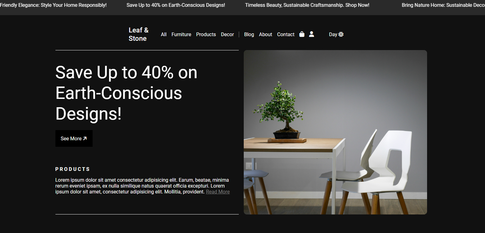

# 🏡 Minimalist Interior Design Website  

This project is a **fully responsive** and **minimalist website** for a fictional interior design company, designed to reflect a **clean and modern aesthetic**. The layout leverages **grid** and **flexbox** techniques to organize content effectively, enhancing both visual appeal and usability.  

The site features:  
- A **smooth loading screen** to create a polished first impression.  
- Subtle **hover transitions** for interactivity and fluid navigation.  
- A **marquee element** to introduce dynamic movement, elevating user engagement.  
- A **dark/light mode toggle**, allowing users to customize their viewing experience.  

The **responsive design** ensures a consistent and seamless experience across all devices, from desktops to mobile screens.  

---

## 🛠️ Main Features  
- **Dark/Light mode toggle** for user customization  
- **Marquee** for dynamic content flow  
- **Grid and flex layouts** for an organized and visually appealing structure  
- **Responsive design** for seamless usability across all devices  
- **Smooth transitions** for interactive navigation  
- **Loading animation** for a polished user experience  

---

## 📷 Screenshots  
## Light Mode

## Dark Mode

